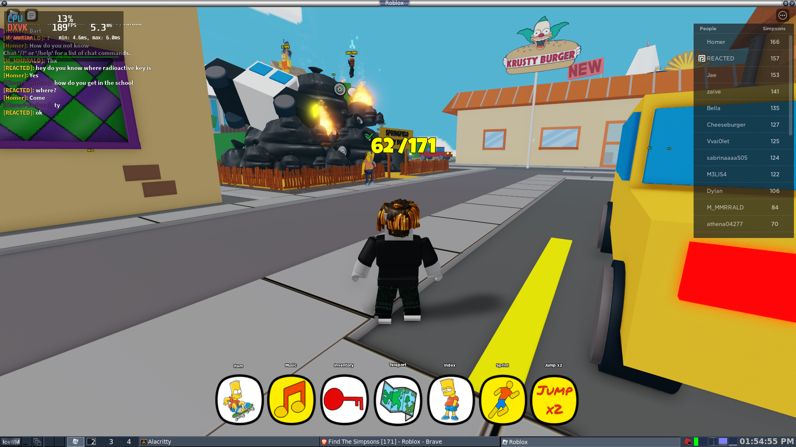

# Roblox for NixOS

This package makes it super easy to install Roblox on NixOS.



Note that while this is a Nix package, it does have some constraints:

- Your hardware must meet the Roblox minimum requirements.
- You need to install the package on NixOS via either `environment.systemPackages` or `users.users.*.packages`; It will not work with `nix-env`, `nix profile`, `nix-shell`, etc. The reason is that Roblox is accessed via a web browser and therefore protocol handlers need to be set up (.aka a .desktop file).

Here's an example installation:

```

  users.users.gaminguser = {
    isNormalUser = true;
    group = "users";

    packages = [ erosanix.packages.x86_64-linux.roblox ];
  };

```

## Features

This Roblox package defaults to using OpenGL, but includes the following options:

- DXVK support
- HUD support (provided by MangoHUD) 
- FPS Unlocker support

```
environment.systemPackages = [
  (erosanix.packages.x86_64-linux.roblox.override { 
    enableHUD = true; 
    enableDXVK = true;
    enableFPSUnlocker = true;
  })
];
```

There's no built-in support for NVIDIA offload rendering, but that's because I have a wrapper for exactly that purpose!

```
environment.systemPackages = [
  (erosanix.lib.x86_64-linux.nvidia-offload-wrapper
    (erosanix.packages.x86_64-linux.roblox.override { 
      enableHUD = true; 
      enableDXVK = true;
      enableFPSUnlocker = true;
    })
  )
```
