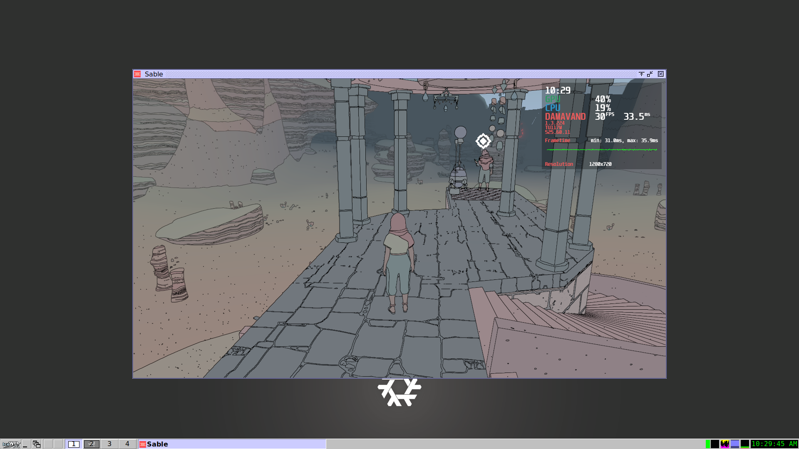

# Sable

[Sable](https://www.shed-works.co.uk/sable) runs flawlessly on Linux using [Wine](https://www.winehq.org). This Nix package provides a launcher for _Sable_. It takes care of creating and maintaining a Wine prefix (aka. Wine bottle) allowing you to launch the game from your window manager's application menu; Like any other program. _However_, this package does not provide the game itself.

# Requirements

_Sable_ is a Windows 64-bit DirectX 11 application. Therefore, you need a x86-64 NixOS system and 64-bit OpenGL or Vulkan Linux drivers for your GPU.

# Installation

1. Use Epic Game Launcher (or an equivalent such as Rage or legendary) to install _Sable_. If you already have it installed on Windows, you can use that as well. The point is to get the _Sable_ directory, which contains the game and game data.
2. Copy the _Sable_ directory to `$HOME/Games/`. To clarify, you should have the file `$HOME/Games/Sable/Sable.exe`.
3. Install this package. You can now use it to run _Sable_!

# Game state

The game state data is saved to `$HOME/.local/share/sable/AppData/LocalLow/Shedworks/Sable/SaveData`.

# Configuration

This _Sable_ Nix package provides the following options via package overrides:

- OpenGL or Vulkan rendering
- HUD support is provided by MongoHUD.
- NVIDIA-offload rendering is provided by a separate Nix function.

## OpenGL

OpenGL is used by default (with the `enableVulkan` attribute set to `false`).

## Vulkan

When `enableVulkan` is set to `true`, the package will choose either Wine's built-in vulkan implementation or DXVK, depending on the compatibility between Wine and DXVK.

```
(erosanix.packages.x86_64-linux.sable.override { 
  enableVulkan = true;
})
```

## HUD

```
(erosanix.packages.x86_64-linux.sable.override { 
  enableHUD = true; 
})
```

## NVIDIA offload rendering

```
(erosanix.lib.x86_64-linux.nvidia-offload-wrapper
  erosanix.packages.x86_64-linux.sable
)
```
